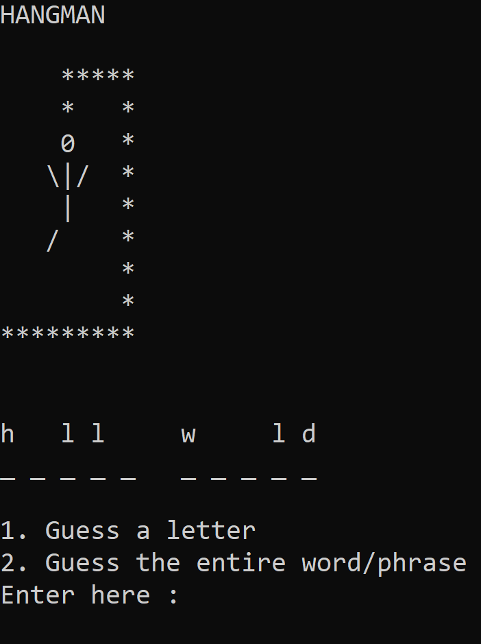

# Project Hangman
**A console-based Windows implementation of the paper and pencil guessing game of hangman in C++**

## Rules:
- Game is designed for 2 players.
- One person enters a word/phrase (which can include spaces and special characters) as the word/phrase to be guessed.
- A screen appears with dashes indicating letters of the word/phrase (dash does not occur for spaces).
- The other person must either: 
    - type in a letter which they think exists 
    - choose to enter the entire word/phrase at once.
- If 6 wrong guesses are made for which letters could exist, the person loses the game.

